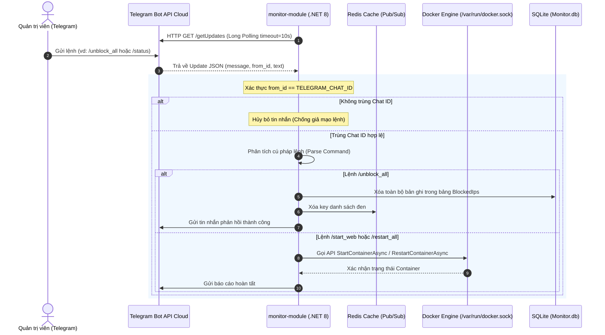

# 🤖 HƯỚNG DẪN VẬN HÀNH VÀ CƠ CHẾ HOẠT ĐỘNG CỦA TELEGRAM SECURITY BOT
### (Telegram Bot Operational Guide & Automated Incident Response Manual)

> **Dự án:** WEF Monitoring System - Docker Security Shield  
> **Tác giả:** Võ Quốc Thắng (MSSV: 231A011150) - Ngành An toàn Thông tin, Trường Đại học Văn Hiến  
> **Mã nguồn:** [GitHub Repository](https://github.com/Hulk1809/WEF-monitoring-system)

---

## 📌 1. TỔNG QUAN VỀ TELEGRAM SECURITY BOT

Trong kiến trúc **Phòng thủ Đa tầng 4 Lớp (Defense-in-Depth)** của hệ thống Docker Security Shield, **Telegram Security Bot** đóng vai trò là hạt nhân của **Lớp 4: Giám sát Tích cực và Phản ứng Sự cố (Active Monitoring & Emergency Response)**.

```
┌────────────────────────────────────────────────────────────────────────┐
│               HẠ TẦNG GIÁM SÁT VÀ PHẢN ỨNG SỰ CỐ TỰ ĐỘNG               │
└────────────────────────────────────────────────────────────────────────┘
       ▲                                                 │
       │ (1. Đọc stream log qua Docker Socket)           │ (2. Bắn cảnh báo tức thời)
       │                                                 ▼
┌───────────────────┐    HTTP API (Port 5001)    ┌───────────────────────┐
│   secure-app      │ ◄───────────────────────── │    monitor-module     │
│   (AI-Driven WAF) │ ◄── [Redis Pub/Sub <1ms] ─ │  (Bộ não Điều phối)   │
└───────────────────┘                            └───────────────────────┘
                                                             │
                                        Long Polling & HTTPS │ (3. Hai chiều: Cảnh báo
                                                             │     & Nhận lệnh quản trị)
                                                             ▼
                                                 ┌───────────────────────┐
                                                 │   📱 TELEGRAM APP     │
                                                 │   (Admin / SOC Team)  │
                                                 └───────────────────────┘
```

Bot đảm nhận 2 nhiệm vụ cốt lõi:
1. **Kênh Cảnh báo Khẩn cấp Tức thời (Real-time Out-of-Band Alerting):** Ngay khi AI WAF phát hiện mã độc (SQLi, XSS) hoặc thuật toán Sliding Window phát hiện rà quét 404 vượt ngưỡng, Bot sẽ lập tức biên dịch thông tin nhận dạng kẻ tấn công (IP, Quốc gia, Payload, Dấu thời gian) và bắn tin nhắn cảnh báo đỏ đến điện thoại của Quản trị viên (Admin).
2. **Kênh Điều khiển Từ xa Dự phòng (Out-of-Band Remote Control / C2 Quản trị):** Khi xảy ra sự cố mạng hoặc Admin không ngồi trước máy tính/Dashboard, Admin có thể tương tác trực tiếp bằng các lệnh Slash Commands qua Telegram để mở khóa IP, nạp Whitelist, khởi động lại container ứng dụng hoặc kiểm tra tình trạng tài nguyên hệ thống.

---

## 🏗️ 2. KIẾN TRÚC KỸ THUẬT VÀ LUỒNG VẬN HÀNH (HOW IT WORKS UNDER THE HOOD)

### 2.1. Cơ chế Lắng nghe Lệnh (Command Listener - Long Polling Loop)
Telegram Bot trong `monitor-module` không mở cổng Webhook công khai (tránh rủi ro bị tấn công trực diện từ Internet), mà chạy ngầm một Background Worker Task mang tên `MonitorTelegramCommandsLoopAsync` bên trong tiến trình .NET 8:



### 2.2. Cơ chế Xác thực và Phân quyền Bảo mật (Security & Authorization)
* **Kiểm tra Chat ID:** Mỗi lệnh gửi đến Bot đều được bóc tách thuộc tính `from.id`. Hệ thống so sánh đối chiếu với biến môi trường `TELEGRAM_CHAT_ID`.
* **Miễn nhiễm với Spammer/Attacker:** Nếu bất kỳ tài khoản Telegram nào khác nhắn tin vào Bot, hệ thống sẽ **bỏ qua hoàn toàn (Drop packet)**, không phản hồi và không thực thi bất kỳ thao tác nào trên máy chủ.
* **Cơ chế Tự phục hồi Kết nối (Fault-Tolerance):** Nếu đường truyền mạng AWS bị chập chờn hoặc Telegram API bị gián đoạn, khối `try-catch` sẽ tự động chờ 5 giây rồi tự động tái kết nối, đảm bảo Bot không bao giờ bị Crash (chết tiến trình).

---

## 🚨 3. CÁC DẠNG CẢNH BÁO TỰ ĐỘNG CỦA BOT (PROACTIVE SECURITY ALERTS)

Hệ thống tự động phát hiện và gửi thông báo tức thời theo từng cấp độ bảo mật:

### 3.1. Cảnh báo Tấn công Mã độc (AI WAF Blocked) - Cấp độ 1
Kích hoạt khi AI WAF tại `secure-app` phát hiện các chuỗi độc hại (SQL Injection, XSS, Evasion với Inline Comments):

```text
🛡️ CẢNH BÁO TẤN CÔNG (IP BLOCKED) 🛡️

Kiểu tấn công: SQL INJECTION
IP nguồn: 14.191.229.233 (Vietnam 🇻🇳)
Payload: ?id=1' UNION/*bypass*/SELECT/*waf*/1,2--
Hành động: Hệ thống đã CHẶN ĐỨNG địa chỉ IP này. Web vẫn hoạt động bình thường cho người dùng khác.
```
* **Cơ chế:** IP kẻ tấn công được đẩy tức thì vào danh sách `BlockedIps` trong bộ nhớ RAM, lưu vào SQLite và đồng bộ sang toàn bộ cụm web qua kênh Redis Pub/Sub `blocked-ips-channel` dưới 1 mili-giây.

---

### 3.2. Cảnh báo Tấn công Rà quét 404 (Sliding Window Rate Limit) - Cấp độ 1
Kích hoạt khi một địa chỉ IP gửi dồn dập các request vào đường dẫn không tồn tại (Directory / Endpoint Brute-forcing) vượt quá **5 lần trong vòng 60 giây**:

```text
🛡️ DOCKER SECURITY SHIELD ALERT 🛡️

Phát hiện rà quét vượt ngưỡng!
IP tấn công: 14.191.229.233
Hành động: Hệ thống đã tự động KHÓA IP này. Web vẫn hoạt động bình thường cho những người dùng khác.
```
* **Cơ chế:** Ngay sau cảnh báo này, mọi request tiếp theo từ IP trên sẽ nhận mã phản hồi `HTTP 403 Forbidden` thay vì `404`.

---

### 3.3. Cảnh báo Khẩn cấp Cô lập Dịch vụ (Emergency Container Isolation) - Cấp độ 2
Kích hoạt khi hệ thống chịu áp lực tải CPU/RAM vượt ngưỡng hiểm nghèo (> 85% - 95%) hoặc phát hiện hành vi tấn công từ chối dịch vụ (DoS/DDoS) nguy cơ làm lộ lọt cơ sở dữ liệu:

```text
🚨 DOCKER SECURITY SHIELD ALERT 🚨

Phát hiện tấn công rà quét vượt ngưỡng!
IP tấn công: 14.191.229.233
Hành động: Hệ thống đã tự động dừng Container secure-app để cô lập an toàn cơ sở dữ liệu!
```
* **Cơ chế:** `monitor-module` tương tác qua Docker Socket `/var/run/docker.sock` gọi lệnh `StopContainerAsync` trên container `secure-app`, bảo vệ dữ liệu nghiệp vụ của PostgreSQL.

---

### 3.4. Cảnh báo Thao tác Quản trị (Admin Audit Logging)
Mỗi khi Quản trị viên can thiệp hệ thống qua Web Dashboard hoặc Telegram (mở khóa IP, thêm Whitelist), Bot đều gửi một bản tin kiểm toán:

```text
✅ GỠ CHẶN QUA DASHBOARD
- IP: 14.191.229.233 đã được mở khóa tự do truy cập bởi Quản trị viên.
```

---

## 📋 4. BẢNG TRA CỨU DANH SÁCH LỆNH ĐIỀU KHIỂN (COMMAND REFERENCE)

Quản trị viên có thể gửi trực tiếp các lệnh sau vào khung chat của Bot:

| Lệnh (Command) | Tham số | Ý nghĩa & Hành vi hệ thống | Tác động ngầm (Backend Execution) |
| :--- | :--- | :--- | :--- |
| `/help` hoặc `/start` | Không | Hiển thị menu hướng dẫn và danh sách các lệnh được hỗ trợ. | Trả về chuỗi Markdown định dạng danh sách lệnh. |
| `/status` | Không | Báo cáo tình trạng sức khỏe hệ thống thời gian thực. | Kiểm tra `IsContainerRunning` trên Docker Socket, đếm số IP bị khóa, trả về trạng thái tổng thể (`SAFE`, `UNDER_ATTACK`, `ISOLATED`). |
| `/stats` | Không | Thống kê số cuộc tấn công trong 24 giờ qua. | Truy vấn SQLite `MonitorDbContext` thống kê số vụ SQLi, XSS, tổng số IP đang bị Blacklist và Whitelist. |
| `/blocked` hoặc `/list_blocked` | Không | Liệt kê chi tiết toàn bộ các địa chỉ IP đang bị khóa truy cập. | Quét danh sách in-memory `BlockedIps` và trả về danh sách IP kèm mốc thời gian khóa. |
| `/unblock <ip>` | `<ip>` | Gỡ chặn riêng cho một địa chỉ IP nhất định. | Xóa IP khỏi RAM cache `BlockedIps` và xóa bản ghi khỏi bảng `BlockedIps` trong SQLite. |
| `/unblock_all` | Không | Gỡ chặn toàn bộ các IP đang bị khóa (Mở khóa sạch). | Gọi `BlockedIps.Clear()`, dọn sạch bảng trong DB SQLite, giải phóng lưu lượng cho toàn bộ người dùng. |
| `/whitelist <ip>` | `<ip>` | Đưa IP vào danh sách tin cậy (Bỏ qua kiểm tra WAF & Rate Limit). | Tự động gỡ chặn nếu IP đang bị khóa; thêm vào `WhitelistedIps` trong RAM và SQLite. |
| `/unwhitelist <ip>` | `<ip>` | Loại bỏ IP khỏi danh sách tin cậy. | Xóa IP khỏi `WhitelistedIps` trong RAM và SQLite. |
| `/start_web` (hoặc `/restore`) | Không | Khởi chạy lại Container `secure-app` sau khi bị cô lập. | Gửi tín hiệu Docker API `StartContainerAsync` tới daemon Docker, phục hồi dịch vụ Web mà vẫn giữ nguyên danh sách IP bị khóa. |
| `/restart_all` | Không | Khởi động lại toàn bộ các container dịch vụ (`secure-app`, `postgres-db`, `nginx-proxy`). | Gửi tín hiệu `RestartContainerAsync` lần lượt cho cả 3 container dịch vụ, làm mới hoàn toàn tiến trình hệ thống. |

---

## 💡 5. PHÂN BIỆT MÃ LỖI TRẢ VỀ: `400 BAD REQUEST` VS `403 FORBIDDEN`

Trong quá trình vận hành và kiểm thử, rất nhiều bạn nhầm lẫn giữa hai mã trạng thái này:

```
                  ┌─────────────────────────────────────────────────┐
                  │                 LƯU LƯỢNG MẠNG                  │
                  └─────────────────────────────────────────────────┘
                                           │
             ┌─────────────────────────────┴─────────────────────────────┐
             ▼                                                           ▼
┌─────────────────────────┐                                 ┌─────────────────────────┐
│     HTTP 400 BAD REQ    │                                 │   HTTP 403 FORBIDDEN    │
├─────────────────────────┤                                 ├─────────────────────────┤
│ Do AI WAF trả về        │                                 │ Do Khóa IP (IP Ban)     │
│ IP vẫn được phép kết nối│                                 │ IP bị chặn ngay ở cổng  │
│ nhưng PAYLOAD chứa mã   │                                 │ vào, không được phép    │
│ độc hại (SQLi / XSS).   │                                 │ gửi bất kỳ dữ liệu nào. │
└─────────────────────────┘                                 └─────────────────────────┘
```

1. **`HTTP 400 Bad Request`:** 
   * **Bản chất:** AI WAF phân tích payload (tham số URL hoặc Body) và phát hiện mẫu tấn công độc hại.
   * **Hành vi:** WAF chặn không cho câu lệnh SQL độc hại thực thi vào Database. Dù bạn có mở khóa IP thành công, nếu bạn vẫn gửi payload chứa mã độc (`UNION SELECT`), hệ thống **vẫn sẽ trả về 400**.
2. **`HTTP 403 Forbidden`:**
   * **Bản chất:** Địa chỉ IP đã bị ghi vào danh sách đen (Blacklist) của hệ thống do vi phạm chính sách bảo mật (quét 404 nhiều lần hoặc đã từng tấn công trước đó).
   * **Hành vi:** Kể cả khi người dùng truy cập trang chủ bình thường (`/`), hệ thống chặn ngay lập tức. Sau khi gõ `/unblock_all` trên Telegram, truy cập bình thường sẽ trả về **`HTTP 200 OK`**.

---

## ⚙️ 6. CẤU HÌNH BIẾN MÔI TRƯỜNG CHO TELEGRAM BOT

Để Bot hoạt động chính xác trên cả môi trường Local và AWS EC2, khai báo các biến môi trường sau trong tệp `.env`:

```env
# Token cấp từ @BotFather trên Telegram
TELEGRAM_BOT_TOKEN=8783186321:AAEpUPOLOGW8UcHmi3n_bqTlnu1FJSSivp4

# ID tài khoản Telegram cá nhân hoặc Group ID của Quản trị viên (lấy qua @userinfobot)
TELEGRAM_CHAT_ID=6414047560

# Kết nối Redis để đồng bộ khóa IP dưới 1 mili-giây
REDIS_CONNECTION=redis-cache:6379
```

Đồng thời ánh xạ vào dịch vụ `monitor-module` trong `docker-compose.yml`:
```yaml
  monitor-module:
    environment:
      - TELEGRAM_BOT_TOKEN=${TELEGRAM_BOT_TOKEN}
      - TELEGRAM_CHAT_ID=${TELEGRAM_CHAT_ID}
      - REDIS_CONNECTION=redis-cache:6379
    volumes:
      - /var/run/docker.sock:/var/run/docker.sock:ro
      - monitor_data:/app/data
```

---

## 🛠️ 7. XỬ LÝ SỰ CỐ THƯỜNG GẶP (TROUBLESHOOTING)

### Vấn đề 1: Bot không phản hồi khi gửi lệnh Slash Command
* **Kiểm tra Chat ID:** Đảm bảo tin nhắn được gửi từ đúng tài khoản Telegram có ID trùng với `TELEGRAM_CHAT_ID`. Nếu dùng tài khoản khác, Bot sẽ tự động bỏ qua vì lý do an toàn.
* **Kiểm tra tiến trình container:** Chạy lệnh sau để xem log của bot:
  ```bash
  docker logs --tail 50 -f monitor-module
  ```
  Nếu thấy dòng `[TELEGRAM COMMANDS] Khởi chạy vòng lặp lắng nghe lệnh từ Telegram...` tức là Bot đang sẵn sàng.

### Vấn đề 2: Tấn công thử nghiệm nhưng Telegram không nổ chuông cảnh báo
* **Kiểm tra Whitelist:** Nếu địa chỉ IP của máy kiểm thử (CentOS / Kali) đã vô tình được thêm vào Whitelist trước đó, WAF vẫn chặn nhưng hệ thống sẽ không gửi cảnh báo để tránh nhiễu Admin. Gõ `/unwhitelist <IP>` để kích hoạt lại cảnh báo.
* **Kiểm tra kết nối Internet từ Container:** Container `monitor-module` cần ra được Internet để kết nối tới `api.telegram.org`. Kiểm tra Security Group (Outbound Rules) trên AWS EC2 cho phép cổng 443 ra ngoài.

---

*Tài liệu được biên soạn đồng bộ cùng mã nguồn dự án WEF Monitoring System - 2026.*
